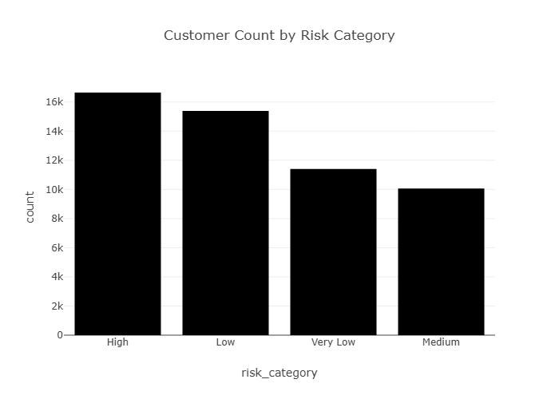
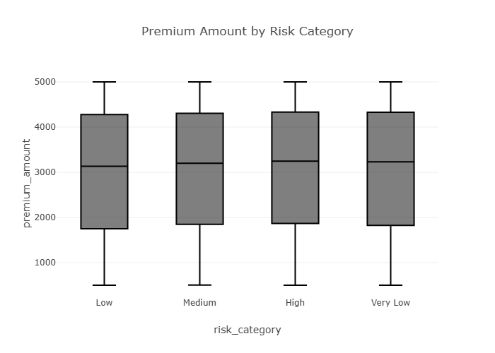
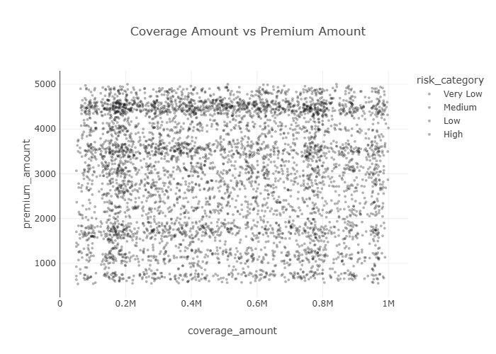
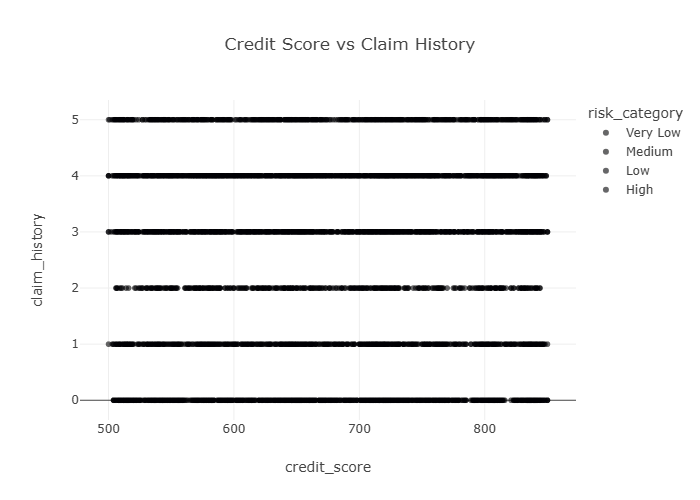
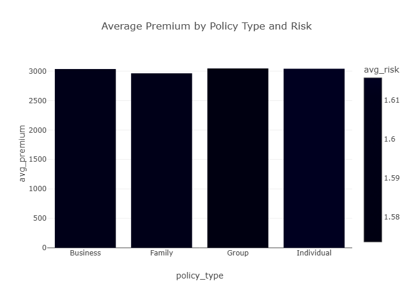

# Insurance Risk, Pricing & Customer Segmentation Analytics Dashboard

## Overview

This project is an end-to-end insurance analytics and machine learning project focused on customer risk analysis, pricing behavior, claims analysis, and customer segmentation.

The project combines:

- Python analytics
- SQL analysis
- Interactive dashboarding
- Machine learning
- Business intelligence

The goal is to simulate real-world actuarial and quantitative insurance analytics workflows.

---

# Business Problem

Insurance companies need to:

- Identify high-risk customers
- Improve pricing strategies
- Reduce claim-related losses
- Improve underwriting decisions
- Better segment customers
- Improve portfolio profitability

This project analyzes insurance customer and policy data to support these business decisions.

---

# Technologies Used

- Python
- pandas
- NumPy
- SQL
- SQLite
- Streamlit
- Plotly
- scikit-learn
- Jupyter Notebook
- Git & GitHub

---

# Project Structure

```text
insurance-risk-analysis/
│
├── data/
├── notebooks/
├── dashboard/
├── images/
├── models/
├── reports/
├── requirements.txt
└── README.md
```

---

# Dashboard Preview


---

# Risk Analysis

This analysis visualizes customer distribution across insurance risk categories.

## Business Insight

- Helps identify high-risk customer groups
- Supports underwriting decisions
- Helps monitor portfolio risk exposure

## Code

```python
risk_count = filtered_df["risk_category"].value_counts().reset_index()

fig = px.bar(
    risk_count,
    x="risk_category",
    y="count",
    title="Customer Count by Risk Category"
)
```

## Visualization



---

# Premium Pricing Analysis

This analysis compares premium amounts across different customer risk categories.

## Business Insight

- Evaluates pricing consistency
- Identifies potential underpriced high-risk groups
- Supports pricing optimization

## Code

```python
fig = px.box(
    filtered_df,
    x="risk_category",
    y="premium_amount",
    title="Premium Amount by Risk Category"
)
```

## Visualization



---

# Coverage vs Premium Analysis

This scatter plot analyzes the relationship between coverage amount and premium pricing.

## Business Insight

- Coverage alone does not fully explain premium pricing
- Additional variables influence pricing decisions
- Helps evaluate insurance pricing strategies

## Code

```python
fig = px.scatter(
    filtered_df.sample(5000),
    x="coverage_amount",
    y="premium_amount",
    color="risk_category",
    opacity=0.3
)
```

## Visualization



---

# Credit Score vs Claim History

This analysis explores the relationship between customer credit score and claim behavior.

## Business Insight

- Lower credit scores may correlate with increased claims
- Supports customer risk segmentation
- Helps improve underwriting strategies

## Code

```python
fig = px.scatter(
    filtered_df,
    x="credit_score",
    y="claim_history",
    color="risk_category"
)
```

## Visualization



---

# Policy Risk Analysis

This analysis compares premium, claims, and risk across policy types.

## Business Insight

- Identifies high-risk policy groups
- Supports pricing review decisions
- Helps monitor policy profitability

## SQL Query

```sql
SELECT
    policy_type,
    AVG(premium_amount) AS avg_premium,
    AVG(claim_history) AS avg_claim_history,
    AVG(risk_profile) AS avg_risk
FROM insurance_policies
GROUP BY policy_type;
```

## Visualization



---

# Machine Learning Model

A Random Forest classification model was built to predict whether a customer belongs to the high-risk category.

## Target Variable

- High Risk = 1
- Not High Risk = 0

## Features Used

- Customer demographics
- Income level
- Claim history
- Credit score
- Premium amount
- Coverage amount
- Deductible
- Policy type
- Segmentation group

---

# Machine Learning Workflow

## Model Training

```python
rf_model = Pipeline(
    steps=[
        ("preprocessor", preprocessor),
        ("model", RandomForestClassifier(
            n_estimators=100,
            random_state=42,
            class_weight="balanced"
        ))
    ]
)

rf_model.fit(X_train, y_train)
```

---

# Feature Importance Analysis

Feature importance analysis identifies variables most strongly influencing high-risk predictions.

## Business Insight

- Helps insurers understand key drivers of customer risk
- Supports underwriting transparency
- Improves pricing and segmentation decisions

## Code

```python
importance_df = pd.DataFrame({
    "feature": feature_names,
    "importance": rf.feature_importances_
}).sort_values(by="importance", ascending=False)
```

## Visualization


---

# Dashboard Features

The Streamlit dashboard includes:

- Interactive filters
- KPI cards
- Risk analysis
- Pricing analysis
- Claims analysis
- Customer segmentation
- Business insights
- Interactive visualizations

---

# Key Business Insights

- Higher claim history is associated with elevated customer risk
- Credit score helps support customer risk segmentation
- Certain policy groups show higher average risk
- Premium pricing depends on multiple customer risk variables
- Customer segmentation improves insurance portfolio analysis

---

# How To Run The Project

## Clone Repository

```bash
git clone https://github.com/YOUR_USERNAME/insurance-risk-analysis.git
```

## Open Project

```bash
cd insurance-risk-analysis
```

## Create Virtual Environment

```bash
python -m venv venv
```

## Activate Environment

### Windows

```bash
venv\\Scripts\\activate
```

### Mac/Linux

```bash
source venv/bin/activate
```

## Install Dependencies

```bash
pip install -r requirements.txt
```

---

# Run Jupyter Notebook

```bash
jupyter notebook
```

---

# Run Streamlit Dashboard

```bash
streamlit run dashboard/app.py
```

Dashboard opens in browser at:

```text
http://localhost:8501
```

---

# Git & GitHub Workflow

## Add Files

```bash
git add .
```

## Commit Changes

```bash
git commit -m "Add advanced insurance analytics dashboard"
```

## Push To GitHub

```bash
git push
```

---

# Future Improvements

- Advanced actuarial modeling
- Claim amount prediction
- Insurance fraud detection
- Customer churn prediction
- Cloud deployment
- API integration
- Real-time analytics

---

# Conclusion

This project demonstrates:

- Insurance analytics
- Quantitative risk analysis
- SQL analytics
- Interactive dashboard development
- Machine learning
- Business intelligence
- Data storytelling

The project reflects practical skills relevant to actuarial, quantitative analyst, and insurance analytics roles.