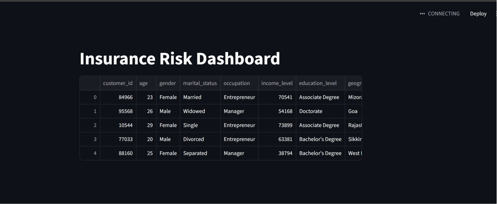

# Insurance Risk, Pricing & Customer Segmentation Analytics Dashboard

## Overview

This project is an end-to-end insurance analytics and machine learning portfolio project designed to simulate real-world actuarial, quantitative analyst, and insurance data analyst workflows.

The project analyzes insurance customer, policy, risk, and behavioral data to identify:

* High-risk customers
* Pricing patterns
* Claim behavior
* Customer profitability trends
* Insurance segmentation insights
* Risk prediction opportunities using machine learning

The project combines:

* Python analytics
* SQL analysis
* Data visualization
* Interactive dashboard development
* Machine learning modeling
* Business insight generation

This portfolio project was built to demonstrate practical skills relevant to:

* Junior Quantitative Analyst
* Actuarial Analyst
* Insurance Data Analyst
* Risk Analyst
* Data Scientist

---

# Business Problem

Insurance companies need to:

* Understand customer risk
* Predict future high-risk customers
* Improve pricing strategies
* Reduce claim-related losses
* Improve customer segmentation
* Optimize profitability

This project analyzes insurance customer and policy data to support these business decisions using analytics and machine learning.

---

# Project Objectives

## Data Analysis Objectives

* Analyze customer demographics
* Analyze risk profile distribution
* Explore claim history behavior
* Analyze premium pricing patterns
* Analyze customer segmentation groups
* Analyze credit score impact on risk
* Analyze policy profitability patterns

## Dashboard Objectives

* Build interactive insurance analytics dashboard
* Create business KPI tracking
* Add interactive filtering capabilities
* Visualize risk and profitability insights

## Machine Learning Objectives

* Predict whether a customer is high risk
* Identify important variables influencing risk
* Evaluate model performance using classification metrics
* Generate interpretable business insights

---

# Technologies Used

| Technology       | Purpose                            |
| ---------------- | ---------------------------------- |
| Python           | Data analysis and machine learning |
| pandas           | Data manipulation                  |
| NumPy            | Numerical operations               |
| SQL              | Insurance analytics queries        |
| SQLite           | Local database storage             |
| Streamlit        | Interactive dashboard              |
| Plotly           | Interactive visualizations         |
| scikit-learn     | Machine learning                   |
| Jupyter Notebook | Analysis workflow                  |
| Git & GitHub     | Version control                    |

---

# Dataset Information

Dataset contains:

* 53,000+ insurance customer records
* Customer demographic information
* Financial information
* Claim history
* Risk profiles
* Credit scores
* Insurance policy information
* Customer segmentation data
* Behavioral data

The dataset includes:

* Numeric variables
* Categorical variables
* Insurance pricing variables
* Risk variables
* Customer behavior variables

---

# Project Structure

```text
insurance-risk-analysis/
│
├── data/
│   ├── raw/
│   └── processed/
│
├── notebooks/
│   ├── 01_data_cleaning.ipynb
│   ├── 02_exploratory_analysis.ipynb
│   ├── 03_risk_analysis.ipynb
│   ├── 04_profitability_analysis.ipynb
│   └── 05_risk_prediction_model.ipynb
│
├── dashboard/
│   └── app.py
│
├── sql/
│
├── reports/
│
├── images/
│
├── models/
│
├── requirements.txt
├── insurance.db
├── .gitignore
└── README.md
```

---

# Folder Explanation

## data/raw

Contains original raw dataset downloaded from Kaggle.

## data/processed

Contains cleaned and transformed datasets used for analysis and dashboarding.

## notebooks

Contains all Jupyter notebooks used for:

* Data cleaning
* Exploratory analysis
* Risk analysis
* Profitability analysis
* Machine learning modeling

## dashboard

Contains Streamlit dashboard application.

## sql

Contains SQL analysis queries used for insurance analytics.

## reports

Contains exported reports, feature importance results, and analysis summaries.

## images

Contains dashboard screenshots and visualization images.

## models

Contains trained machine learning models.

Note:
Large `.pkl` model files are excluded from GitHub because of GitHub file size limitations.

---

# Data Cleaning & Feature Engineering

The following preprocessing and feature engineering tasks were completed:

## Data Cleaning

* Standardized column names
* Converted date columns into datetime format
* Validated missing values
* Structured categorical variables
* Saved cleaned dataset into processed folder

## Feature Engineering

Created:

* Age groups
* Credit score groups
* Premium-to-coverage ratio
* Estimated customer value
* Risk categories
* High-risk classification target variable

Example feature engineering code:

```python
# Create high risk target

df["high_risk"] = np.where(df["risk_profile"] == 3, 1, 0)

# Create age groups

df["age_group"] = pd.cut(
    df["age"],
    bins=[17, 25, 35, 45, 55, 65, 100],
    labels=["18-25", "26-35", "36-45", "46-55", "56-65", "65+"]
)
```

Business Insight:

Feature engineering improves model performance and allows insurance teams to better segment customer risk.

---

# Exploratory Data Analysis

The exploratory analysis focused on:

* Risk profile analysis
* Premium analysis
* Claim behavior
* Customer segmentation
* Credit score analysis
* Policy type analysis

Key statistics analyzed:

* Mean premium amount
* Average claim history
* Risk distribution
* Coverage distribution
* Credit score distribution

Example analysis code:

```python
query = """
SELECT
    policy_type,
    AVG(premium_amount) AS avg_premium,
    AVG(claim_history) AS avg_claim_history,
    AVG(risk_profile) AS avg_risk
FROM insurance_policies
GROUP BY policy_type
"""

result = pd.read_sql(query, conn)
```

Business Insight:

Policy types with higher average risk and claim history may require pricing review or stricter underwriting.

---

# Dashboard Development

An interactive Streamlit dashboard was developed to visualize:

* Executive KPIs
* Risk analysis
* Pricing analysis
* Claim behavior
* Customer segmentation
* Credit score patterns
* Coverage vs premium analysis

Dashboard includes:

* Interactive filters
* Dynamic charts
* KPI cards
* Business insights section
* Data preview section

---

# Dashboard Preview



---

# Dashboard KPIs

The dashboard tracks:

* Total customers
* Average premium amount
* Average coverage amount
* Average risk score
* Average credit score
* Customer segmentation metrics

Example KPI code:

```python
col1.metric("Total Customers", len(filtered_df))
col2.metric("Avg Premium", round(filtered_df["premium_amount"].mean(), 2))
col3.metric("Avg Risk", round(filtered_df["risk_profile"].mean(), 2))
```

Business Insight:

KPI monitoring helps insurance teams quickly identify changes in pricing, risk exposure, and customer portfolio quality.

---

# Risk Analysis

The project analyzed:

* Risk profile distribution
* Risk by policy type
* Risk by age group
* Risk by claim history
* Risk by credit score

Visualization example:

```python
fig = px.box(
    filtered_df,
    x="risk_category",
    y="premium_amount",
    title="Premium Amount by Risk Category"
)
```

Business Insight:

Higher-risk customer groups should generally pay higher premiums to compensate for increased claim probability.

---

# Pricing Analysis

Pricing analysis explored:

* Premium amount by policy type
* Coverage amount vs premium amount
* Premium vs risk profile
* Deductible vs premium

Example chart code:

```python
fig = px.scatter(
    filtered_df.sample(5000),
    x="coverage_amount",
    y="premium_amount",
    color="risk_category",
    opacity=0.3
)
```

Business Insight:

Coverage amount alone does not fully explain premium pricing. Additional risk variables such as claim history and risk profile strongly influence pricing.

---

# Customer Segmentation Analysis

Customer segmentation analysis included:

* Segmentation group analysis
* Occupation analysis
* Education level analysis
* Behavioral data analysis
* Purchase history analysis

Business Insight:

Customer segmentation can support:

* Personalized pricing
* Marketing optimization
* Risk-based underwriting
* Customer retention strategies

---

# Machine Learning Model

A Random Forest classification model was developed to predict whether a customer belongs to the high-risk category.

## Target Variable

* High Risk = 1
* Not High Risk = 0

## Features Used

The model used:

* Customer demographics
* Income level
* Claim history
* Credit score
* Coverage amount
* Premium amount
* Deductible
* Occupation
* Policy type
* Segmentation group
* Behavioral variables

---

# Machine Learning Workflow

## Step 1 — Data Preparation

```python
X = df[features]
y = df["high_risk"]
```

## Step 2 — Train/Test Split

```python
X_train, X_test, y_train, y_test = train_test_split(
    X,
    y,
    test_size=0.2,
    random_state=42,
    stratify=y
)
```

## Step 3 — Build Random Forest Model

```python
rf_model = Pipeline(
    steps=[
        ("preprocessor", preprocessor),
        ("model", RandomForestClassifier(
            n_estimators=100,
            random_state=42,
            class_weight="balanced"
        ))
    ]
)
```

## Step 4 — Train Model

```python
rf_model.fit(X_train, y_train)
```

---

# Model Evaluation

The model was evaluated using:

* Accuracy
* ROC AUC
* Precision
* Recall
* F1-score
* Confusion matrix

Example evaluation code:

```python
print("Accuracy:", accuracy_score(y_test, y_pred_rf))
print("ROC AUC:", roc_auc_score(y_test, y_prob_rf))
print(classification_report(y_test, y_pred_rf))
```

Business Insight:

The model helps identify customers with elevated insurance risk and can support underwriting and pricing decisions.

---

# Feature Importance Analysis

Feature importance analysis was performed to identify which variables most strongly influence high-risk predictions.

Example feature importance code:

```python
importance_df = pd.DataFrame({
    "feature": feature_names,
    "importance": rf.feature_importances_
}).sort_values(by="importance", ascending=False)
```

Business Insight:

Understanding important risk drivers helps insurers:

* Improve pricing models
* Enhance underwriting policies
* Reduce loss exposure
* Improve customer segmentation

---

# SQL Analytics

SQLite database was created for insurance analytics.

Example SQL analysis:

```sql
SELECT
    policy_type,
    AVG(premium_amount) AS avg_premium,
    AVG(claim_history) AS avg_claim_history,
    AVG(risk_profile) AS avg_risk
FROM insurance_policies
GROUP BY policy_type;
```

Business Insight:

SQL analytics enables scalable insurance reporting and business intelligence workflows.

---

# How To Run The Project

## Clone Repository

```bash
git clone https://github.com/YOUR_USERNAME/insurance-risk-analysis.git
```

## Open Project

```bash
cd insurance-risk-analysis
```

## Create Virtual Environment

```bash
python -m venv venv
```

## Activate Virtual Environment

### Windows

```bash
venv\Scripts\activate
```

### Mac/Linux

```bash
source venv/bin/activate
```

## Install Dependencies

```bash
pip install -r requirements.txt
```

---

# How To Run Jupyter Notebook

```bash
jupyter notebook
```

or:

```bash
jupyter lab
```

---

# How To Run Streamlit Dashboard

From project root folder:

```bash
streamlit run dashboard/app.py
```

Browser opens automatically at:

```text
http://localhost:8501
```

---

# Git & GitHub Workflow

## Initialize Git

```bash
git init
```

## Add Files

```bash
git add .
```

## Commit Changes

```bash
git commit -m "Add insurance analytics dashboard and ML model"
```

## Push To GitHub

```bash
git push origin main
```

---

# Important Notes

## Large Model Files

Large `.pkl` model files are excluded from GitHub because of GitHub size limitations.

The model can be regenerated by running:

```text
notebooks/05_risk_prediction_model.ipynb
```

---

# Future Improvements

Future improvements for this project include:

* Advanced actuarial modeling
* Claim amount prediction
* Customer churn prediction
* Insurance fraud detection
* Real-time dashboard deployment
* Cloud deployment
* API integration
* Deep learning models
* Time series forecasting

---

# Key Business Insights

## Risk Insights

* Customers with higher claim history tend to have higher risk profiles.
* Credit score can help support customer risk segmentation.
* Certain policy types appear more risk-intensive.

## Pricing Insights

* Premium pricing is influenced by multiple risk variables.
* Coverage amount alone does not fully explain pricing.
* Some customer groups may require pricing review.

## Segmentation Insights

* Customer segmentation can support personalized insurance strategies.
* Behavioral and demographic variables improve risk understanding.

---

# Conclusion

This project demonstrates an end-to-end insurance analytics workflow combining:

* Data cleaning
* SQL analytics
* Risk analysis
* Business intelligence
* Interactive dashboard development
* Machine learning modeling
* Business insight generation

The project reflects practical quantitative and actuarial analysis concepts relevant to insurance analytics and risk management roles.
